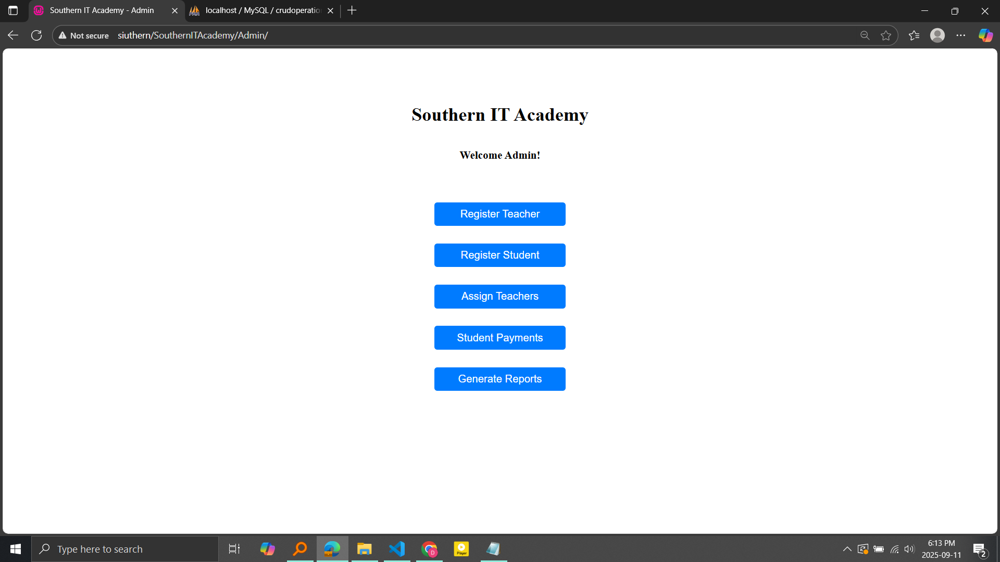

# Southern IT Academy – Simple PHP CRUD App

A lightweight **HTML + CSS + JavaScript + PHP** application demonstrating **Create, Read, Update, Delete (CRUD)** operations.  
Runs on a local PHP server (e.g., XAMPP, WAMP, or built-in PHP server) and uses MySQL/MariaDB as the database.

---

##  Features
- Add, view, edit, and delete student records  
- Responsive layout built with plain HTML/CSS/JS  
- Clean and simple UI for learning and quick demos  


---

##  Requirements
- **PHP** 7.4+  
- **MySQL/MariaDB**  
- A local server stack (XAMPP, WAMP, Laragon, or PHP built-in server)

---

##  Installation & Setup
1. **Clone the repository**
   ```bash
   git clone https://github.com/<your-username>/southern-it-academy.git
   cd southern-it-academy
   ```
2. **Create database**
   - Import the provided `database.sql` file into your MySQL server.  
   - Update `config/db.php` with your database credentials.

3. **Run locally**
   - **XAMPP/WAMP:** Move the folder to `htdocs` (or `www`) and visit  
     [http://localhost/southern-it-academy](http://localhost/southern-it-academy)
   - **Built-in PHP server:**  
     ```bash
     php -S localhost:8000
     ```

---

##  Screenshots

|  |  |  |

---

##  CRUD Flow
1. **Create:** Add a new student record.  
2. **Read:** View the list of all students.  
3. **Update:** Edit details of a student.  
4. **Delete:** Remove a student from the database.


